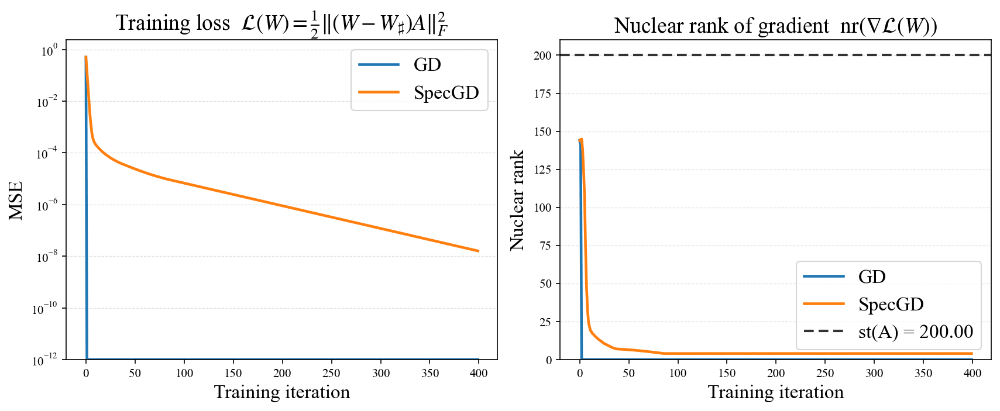
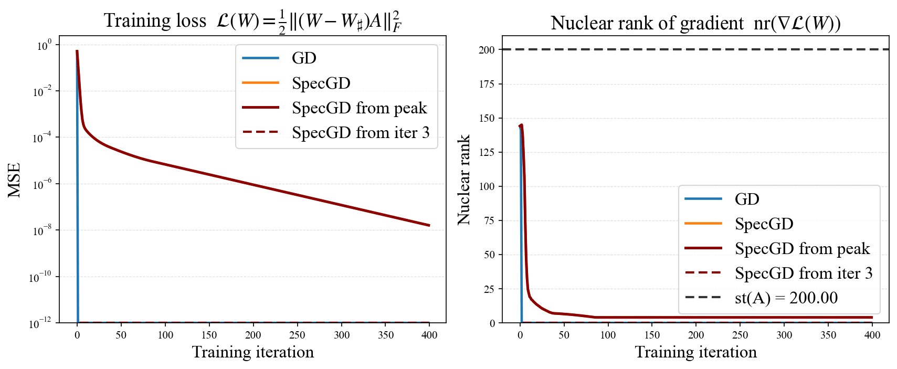
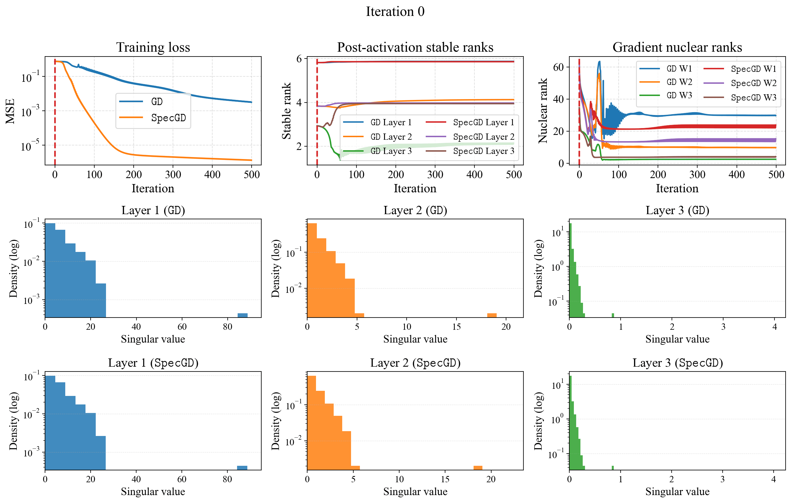

# When do spectral gradient updates help in deep learning?

This repository hosts the official experiments and figures accompanying the paper *When do spectral gradient updates help in deep learning?* (see [`stable_rank.pdf`](stable_rank.pdf)). Everything below reproduces the results from the manuscript: standalone scripts, plotting utilities, and the UV/Python environment for Muon/SpecGD vs GD comparisons.



*Performance tracks the stable rank of the random-feature matrix: as `st(A)` improves, GD and SpecGD converge together.*



*Restarting SpecGD once the GD nuclear rank spikes can make SpecGD better than GD.*



*Four-layer synthetic test from `blog/blog.md`: post-activation spectra stay spiky (low stable rank) while the gradient’s nuclear rank starts much larger and gradually aligns with the learned features.*

## Layout

- `install.sh` – creates `.venv/` using [uv](https://github.com/astral-sh/uv) and installs `requirements.txt`.
- `requirements.txt` – minimal dependency set (PyTorch, NumPy, Matplotlib) shared by all experiments.
- `run_swiglu_stable_rank_sweep.sh` – sweeps batch sizes for the SwiGLU FourLayerNet.
- `run_random_feature_specgd.sh` – launches the single-layer random-feature experiment for ReLU and SwiGLU features and auto-plots the latest JSON log.
- `run_weighted_spectral_vs_gd.sh` – reproduces the weighted spectral vs GD comparisons (ReLU + two SwiGLU configs) and auto-plots each run.
- `modded_nanogpt_july_18/` – untouched July 18, 2025 snapshot of the full speedrun training script and its own installer.
- Remaining `*.py` scripts – direct copies of the experiment/plotting code referenced in the paper.

## Quickstart

1. **Install dependencies**
   ```bash
   cd specgd
   ./install.sh
   ```
   The script ensures `uv` is available, creates `.venv/`, and installs `requirements.txt`.

2. **Activate the environment**
   ```bash
   source .venv/bin/activate
   ```

3. **Run experiments**

   - SwiGLU stable-rank sweep:
     ```bash
     ./run_swiglu_stable_rank_sweep.sh
     ```

   - Random-feature SpecGD (ReLU + SwiGLU runs, outputs + plots land in `specgd/logs_rf/`):
     ```bash
     ./run_random_feature_specgd.sh
     ```

   - Weighted spectral vs GD (ReLU + two SwiGLU settings, logs/plots under `specgd/logs_weighted/`):
     ```bash
     ./run_weighted_spectral_vs_gd.sh
     ```

4. **Plot outputs**

   Each experiment writes JSON/PNG/PDF artifacts under the `logs*` directories noted above. Re-run the plotting utilities (`plot_random_feature_specgd.py`, `plot_spectral_vs_gd.py`, etc.) within the same `.venv` as needed.


